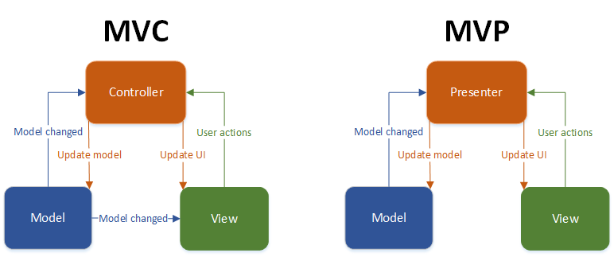
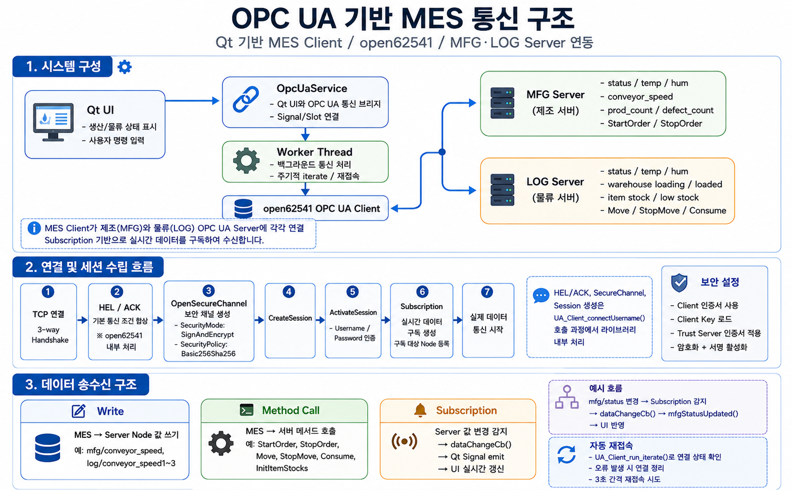
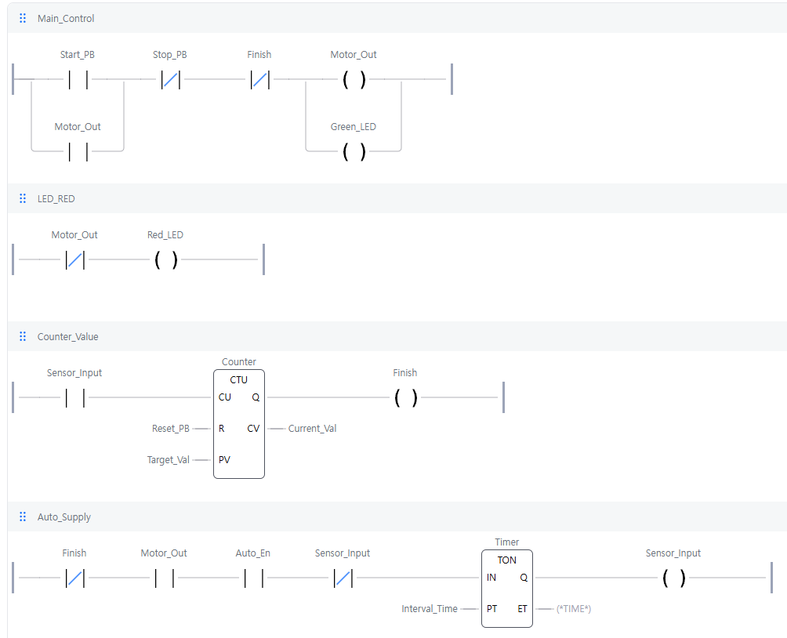
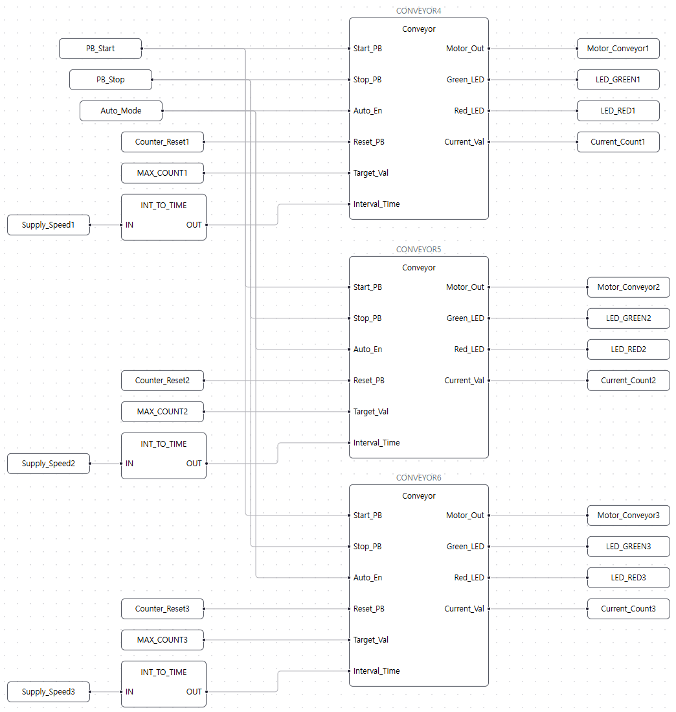
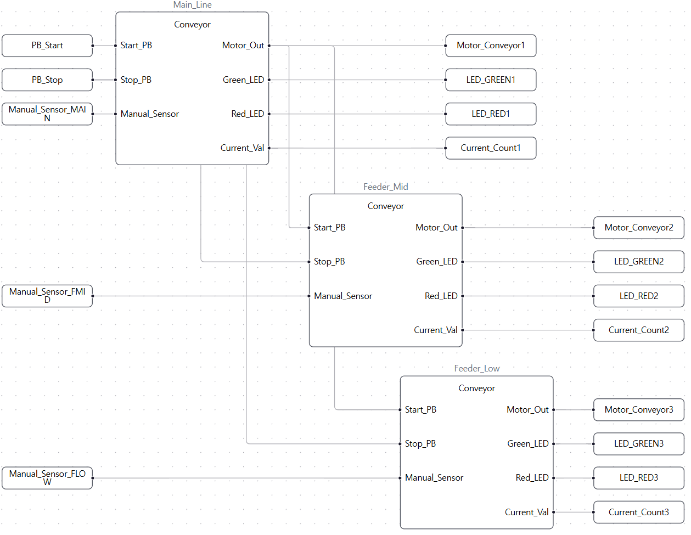
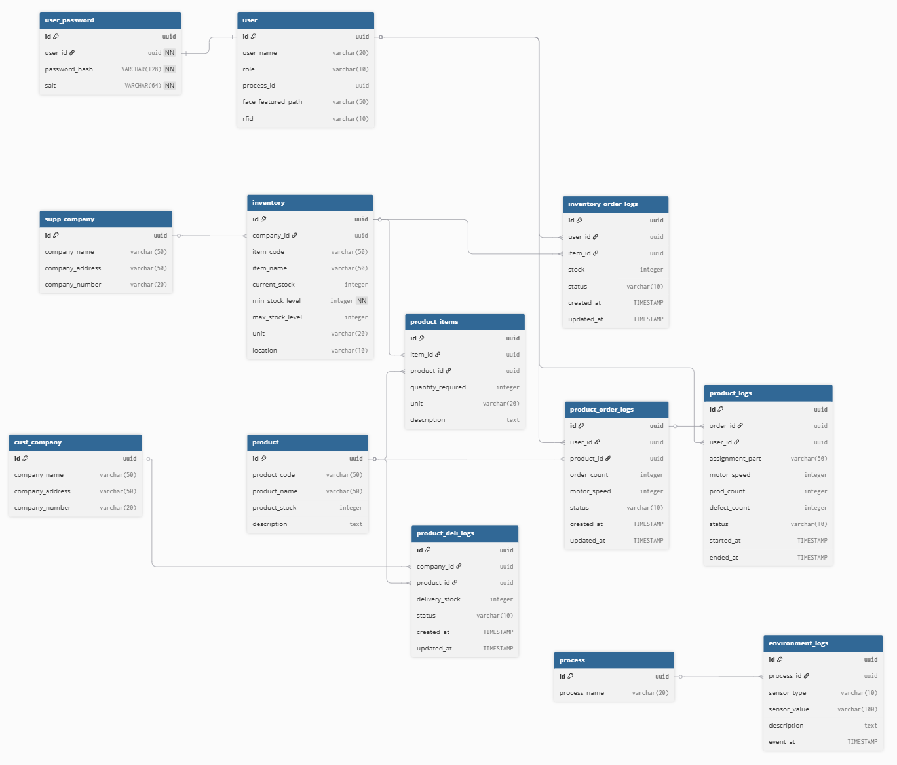
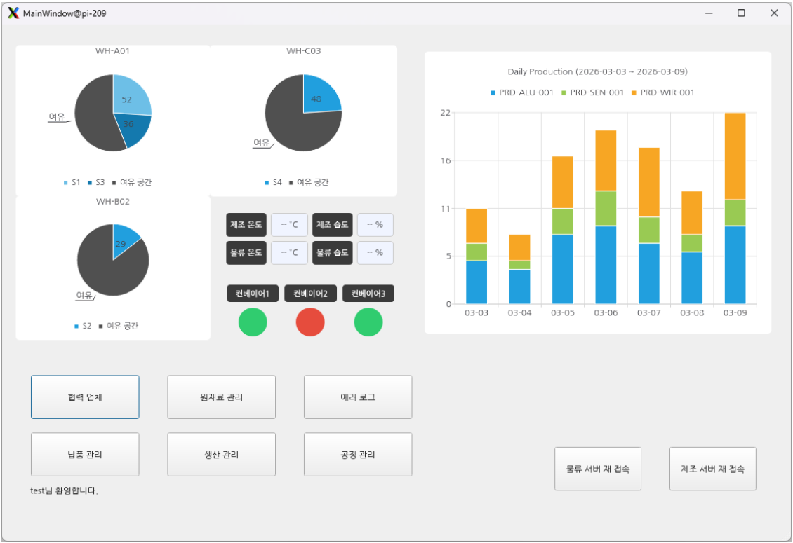
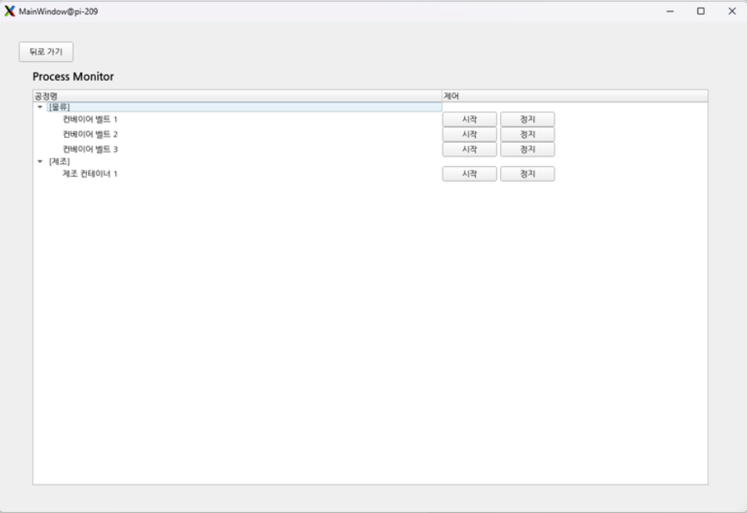
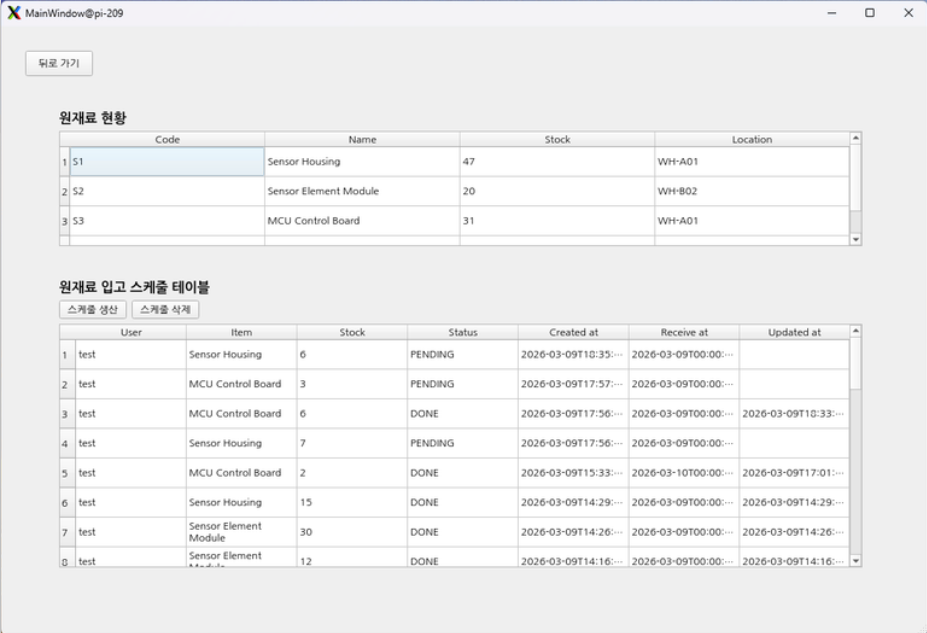

## 🏭 OPC UA 기반 Smart Factory MES 구축 프로젝트

### 🛠 개발 배경
수작업 기반의 생산 관리로 인한 데이터 부정확성을 해결하고, 설비마다 상이한 통신 및 제어 방식을 **OPC UA 표준 프로토콜**로 통합하여 실시간 모니터링 및 체계적인 공정 제어를(MES 모사) 실현하고자 개발하였습니다.

### 📝 한 줄 요약
**OPC UA와 Modbus TCP를 활용하여 분산된 공정 데이터를 통합하고, 실시간 설비 제어 및 생산 이력을 관리하는 스마트 팩토리 제조 실행 시스템(MES)**

---

## 📅 프로젝트 개요
- **프로젝트 명:** OPC UA 기반 MES 구축 프로젝트
- **수행 기간:** 2026.02.25 ~ 2026.03.10
- **주요 기능**
  - **실시간 모니터링:** 공정별 온도, 습도 및 설비 상태(Run/Stop) 실시간 시각화
  - **통합 설비 제어:** OPC UA 및 Modbus TCP를 통한 이기종 설비 원격 제어 (OpenPLC 기반 공정 로직)
  - **데이터베이스 관리:** MariaDB를 활용한 생산 계획, 재고 현황, 환경 로그 저장 및 조회
  - **사용자 인터페이스:** Qt 기반의 직관적인 UI 제공 (HMI Dashboard)

---

## 🛠 기술 스택
| 분류 | 기술 Stack |
| :--- | :--- |
| **Languages** | C, C++ |
| **Communication** | OPC UA (open62541), Modbus TCP |
| **Frameworks** | Qt 6, GStreamer |
| **Database** | MariaDB |
| **Hardware/OS** | Raspberry Pi 3EA, OpenPLC (Simulator) |

---

## 📂 디렉토리 구조
```text
.
├── client/MainUI          # Qt 기반 HMI 클라이언트 (MVP 패턴 적용)
│   ├── src/core           # DB Manager, User Session 관리
│   ├── src/models         # 데이터 구조 정의
│   ├── src/services       # 비즈니스 로직 및 OPC UA 서비스
│   └── src/views          # UI 화면 (Dashboard, Process 등)
├── database               # MariaDB 스키마 및 DB 설정 스크립트 백업
├── servers                # OPC UA 제조(MFG) 및 물류(LOG) 서버 소스
├── servers_mod            # Modbus 통신 기능이 통합된 서버 소스
└── README.md              # 프로젝트 문서

```
---

## 🖥️ 아키텍처 패턴



<details>
  <summary><strong>MVP (Model View Presenter)</strong></summary>

<br>

  **1. MVP 패턴이란?**
MVP 패턴은 UI(View)와 Model을 완전히 분리하고, 그 사이를 Presenter가 Controll하는 구조

Model: 데이터 처리, DB 연동(MariaDB), OPC UA 통신 로직 및 데이터 구조 정의

View: 사용자 인터페이스(Qt Widgets). Presenter의 지시에 따라 화면을 그리며, 사용자 이벤트를 Presenter로 전달

Presenter: View와 Model 사이의 중간 다리 역할. Model로부터 데이터를 받아 가공하고, View에게 어떤 데이터를 어떻게 표시할지 전달

**2. 왜 MVP를 선택했는가? (Why MVP?)**

**A. 비동기 통신(OPC UA) 환경에서의 안정성**

문제점(MVC): MVC 구조에서는 비동기 데이터가 들어올 때 (즉, 통신하는 동안) View가 직접 Model을 참조하거나 갱신에 관여하여 화면 프리징(Freezing)이나 의존성 문제가 발생 가능

해결책(MVP): Presenter가 비동기 데이터를 먼저 수신하여 검증 및 가공을 거친 후, View를 업데이트 하도록 지시함, 이를 통해 데이터 흐름에 따라 직관적으로 UI제어 가능

<br>

**B. Qt Widget 개발 효율성**

문제점(MVVM): Qt Widgets 환경에서 수많은 페이지를 구현할 경우 Q_PROPERTY 선언과 복잡한 Signal/Slot 연결 필요

해결책(MVP): Presenter가 명시적으로 View의 인터페이스를 호출하는 방식으로, 복잡한 바인딩 설정 없이도 다수의 페이지를 깔끔하고 유지보수하기 쉬운 코드로 관리 가능
  
</details>

---


## OPC UA (Communication Layer)



<details>
<summary><strong>OPC UA 기반 MES 통신 구조</strong></summary>

<br>

본 프로젝트에서는 **Qt 기반 MES Client**에서 OPC UA 통신 모듈을 구현하여 제조 서버(MFG Server)와 물류 서버(LOG Server)의 데이터를 연동하였다.  
OPC UA 통신은 `open62541` 라이브러리를 기반으로 구성하였으며, MES 화면에서 설비 상태를 실시간으로 모니터링하고 생산 및 물류 제어 명령을 서버로 전달할 수 있도록 구현하였다.

## 1. 시스템 구성


MES Client는 크게 `Qt UI`, `OpcUaService`, `Worker Thread`, `open62541 OPC UA Client`로 구성된다.

- `Qt UI`는 생산 및 물류 상태를 표시하고 사용자의 명령을 입력받는 화면 역할을 한다.
- `OpcUaService`는 Qt UI와 OPC UA 통신부를 연결하는 브리지 역할을 한다.
- `Worker Thread`는 OPC UA 통신을 백그라운드에서 처리하여 UI가 멈추지 않도록 한다.
- `open62541 OPC UA Client`는 제조 서버와 물류 서버에 각각 연결되어 실제 OPC UA 통신을 수행한다.

본 프로젝트에서는 제조 영역과 물류 영역을 분리하기 위해 두 개의 OPC UA Server에 연결하였다.

| 구분 | 역할 | 주요 데이터 |
|---|---|---|
| MFG Server | 제조 공정 데이터 연동 | 생산 상태, 온습도, 컨베이어 속도, 생산 수량, 불량 수량, 작업 시작/정지 |
| LOG Server | 물류 및 재고 데이터 연동 | 물류 상태, 창고 적재 상태, 재고 수량, 저재고 알림, 물류 이동/소비 명령 |

## 2. OPC UA 연결 흐름

OPC UA 연결은 다음 순서로 이루어진다.

1. TCP 연결
2. HEL / ACK 교환
3. OpenSecureChannel 생성
4. CreateSession
5. ActivateSession
6. Subscription 기반 실시간 구독 생성
7. 실제 데이터 통신 시작

코드에서 HEL/ACK, SecureChannel 생성, Session 생성, ActivateSession 과정을 직접 패킷 단위로 구현하지는 않았다.  
해당 과정은 `open62541` 라이브러리의 `UA_Client_connectUsername()` 함수 호출 과정에서 내부적으로 처리된다.

즉, 프로젝트 코드에서는 OPC UA 연결의 저수준 패킷 처리를 직접 작성하기보다는, `open62541` 라이브러리를 사용하여 Client 설정, 보안 설정, 인증, 서버 연결, 데이터 송수신 로직을 구현하였다.

## 3. 보안 설정

본 프로젝트의 OPC UA Client는 인증서 기반 보안 통신을 사용한다.

| 항목 | 설정 |
|---|---|
| SecurityMode | `SignAndEncrypt` |
| SecurityPolicy | `Basic256Sha256` |
| 인증 방식 | Username / Password |
| Client 인증서 | 사용 |
| Client Key | 사용 |
| Trust Server 인증서 | 사용 |

Client는 연결 전에 인증서, 개인키, 신뢰할 서버 인증서를 로드한다.  
이후 `UA_ClientConfig_setDefaultEncryption()`을 통해 암호화 설정을 적용하고, `SignAndEncrypt` 모드로 서버와 통신한다.

따라서 이 프로젝트의 OPC UA 통신은 단순 평문 통신이 아니라, **암호화와 서명이 적용된 보안 채널**을 기반으로 동작한다.

## 4. 데이터 송수신 구조

연결 이후 MES Client는 OPC UA의 주요 기능인 `Write`, `Method Call`, `Subscription`을 사용한다.

### 4.1 Write

`Write`는 MES에서 서버의 특정 Node 값을 변경할 때 사용한다.

예를 들어 MES 화면에서 컨베이어 속도를 변경하면, 해당 값이 OPC UA Server의 Node에 쓰인다.

예시 Node는 다음과 같다.

- `mfg/conveyor_speed`
- `log/conveyor_speed1`
- `log/conveyor_speed2`
- `log/conveyor_speed3`

이를 통해 MES 화면에서 제조 및 물류 설비의 속도 값을 제어할 수 있다.

### 4.2 Method Call

`Method Call`은 서버에 정의된 기능을 MES Client에서 호출하는 방식이다.

본 프로젝트에서는 생산 시작, 생산 정지, 물류 이동, 자재 소비 등의 명령을 Method Call로 처리하였다.

| Method | 설명 |
|---|---|
| `mfg/StartOrder` | 생산 작업 시작 |
| `mfg/StopOrder` | 생산 작업 정지 |
| `log/Move` | 물류 이동 시작 |
| `log/StopMove` | 물류 이동 정지 |
| `log/Consume` | 자재 소비 처리 |
| `log/InitItemStocks` | 초기 재고 설정 |

즉, 단순히 Node 값을 읽고 쓰는 것뿐만 아니라, 서버 측에 정의된 동작을 직접 실행하는 구조를 구현하였다.

### 4.3 Subscription 기반 실시간 데이터 구독

본 프로젝트에서는 OPC UA의 `Subscription` 기능을 사용하여 제조 서버와 물류 서버의 주요 데이터를 실시간으로 구독하였다.

Client는 생산 상태, 온습도, 생산 수량, 불량 수량, 창고 적재 상태, 재고 수량, 저재고 여부 등의 Node를 구독 대상으로 등록하였다.  
서버의 값이 변경되면 DataChange Callback이 실행되고, 콜백 내부에서 데이터 타입을 판별한 뒤 Qt Signal을 발생시켜 MES UI에 실시간으로 반영하였다.

데이터 흐름은 다음과 같다.

```text
Server Node 값 변경
        ↓
Subscription 기반 데이터 구독
        ↓
DataChange Callback 실행
        ↓
Qt Signal emit
        ↓
MES UI 실시간 갱신
```

예를 들어 제조 서버의 상태값이 변경되면 다음과 같은 흐름으로 UI가 갱신된다.

```text
mfg/status 변경
        ↓
Subscription 감지
        ↓
dataChangeCb()
        ↓
mfgStatusUpdated()
        ↓
Qt UI 반영
```

이를 통해 생산 상태, 온습도, 생산 수량, 불량률, 창고 적재 상태, 재고 부족 여부 등을 실시간으로 모니터링할 수 있다.

## 5. 자동 재접속 구조

OPC UA 통신 안정성을 높이기 위해 자동 재접속 구조를 구현하였다.

`Worker Thread`에서는 주기적으로 `UA_Client_run_iterate()`를 호출하여 OPC UA Client의 상태를 확인한다.  
서버 연결이 끊기거나 오류가 발생하면 기존 연결을 정리하고, 일정 시간 간격으로 재접속을 시도한다.

재접속 흐름은 다음과 같다.

```text
UA_Client_run_iterate()로 연결 상태 확인
        ↓
오류 발생 감지
        ↓
기존 Client 연결 정리
        ↓
3초 간격으로 재접속 시도
        ↓
연결 성공 시 Subscription 재등록
```

이를 통해 서버가 일시적으로 중단되거나 네트워크 문제가 발생하더라도, MES Client가 자동으로 복구를 시도할 수 있도록 하였다.

## 6. 구현 기능 요약

본 프로젝트에서 구현한 OPC UA 통신 기능은 다음과 같다.

- Qt 기반 MES Client와 OPC UA Server 연동
- MFG Server / LOG Server 이중 연결 구조 구현
- Client 인증서, Key, Trust Server 인증서를 활용한 보안 통신 구성
- `SignAndEncrypt` / `Basic256Sha256` 기반 보안 채널 적용
- Username / Password 기반 Session 인증 처리
- 제조 및 물류 데이터 Node Write 기능 구현
- 생산 시작, 정지, 물류 이동, 자재 소비 등 Method Call 기능 구현
- Subscription 기반 실시간 데이터 구독 및 UI 갱신
- 연결 상태 확인 및 3초 간격 자동 재접속 구조 구현 

</details>


<br>

---

## PLC Simulator & Modbus TCP

- **가상 컨베이어 라인 설계**
- **개발 환경** : OpenPLC Editor (LADDER LOGIC)
- **주요 기능**
  - **Conveyor (FBD)**
    - Start / Stop 신호에 따라 작동, 목표 수량 도달 시 정지  
    - 자기 유지 회로 구현
    - 설정된 시간 간격으로 주기적인 카운트 업데이트

  - **원재료 입고 / 완성품 생산 라인 설계**  
    - 3개의 Conveyor FBD를 조합해 각각의 가상 라인 구축
    - 컨베이어 상태에 따른 LED 점등

| FBD | SCM | MANU |
|----------|----------|----------|
|  |  |  |

### Modbus TCP

#### 배경 및 필요성

프로젝트에서 사용하는 **OpenPLC**는 OPC UA 프로토콜을 기본적으로 지원하지 않는다.
OPC UA Server와 제어 신호 및 데이터를 주고받기 위해 두 프로토콜 사이를 중계하는 **Modbus-to-OPC UA 브리지**를 별도로 구성했다.
OPC UA Server에서 발생한 컨베이어 제어 신호는 Modbus를 통해 OpenPLC로 전달되며, 이를 통해 컨베이어의 ON/OFF 제어 및 재고 수량, 생산량 등의 데이터를 갱신한다.

```
[OPC UA Client]
      │  제어 명령 (컨베이어 ON/OFF 등)
      ▼
[OPC UA Server (port 4840)]
      │  Modbus TCP (port 502)
      ▼
[Modbus-to-OPC UA Bridge]
      │  coil write / register read
      ▼
[OpenPLC Simulator]
      │  재고 수량, 생산량 갱신
      ▼
[Modbus-to-OPC UA Bridge]
      │  상태 데이터 반환
      ▼
[OPC UA Server (port 4840)]
```

> Modbus를 선택한 이유: 메인 통신 프로토콜이 아닌 PLC 내부 연동 구간에 해당하므로,
> 구조가 단순하고 구현 부담이 적은 프로토콜이 적합했다.

### Modbus의 특징

| 특징 | 설명 |
|------|------|
| 마스터-슬레이브 구조 | 마스터가 요청을 보내고 슬레이브가 응답하는 단방향 주도 방식 |
| 결정론적 타이밍 | 응답 시점이 예측 가능하여 실시간 제어 환경에 적합 |
| 단순·경량 | 저사양 장비(8비트 마이크로컨트롤러 등)에서도 동작 가능 |
<details>
<summary> Modbus 자료형</summary>

| 자료형 | 비트 수 | 방향 | 용도 |
|--------|---------|------|------|
| `QX` | 1 bit | 출력 (쓰기 가능) | 디지털 출력 — 모터 ON/OFF, 밸브 개폐 등 |
| `IX` | 1 bit | 입력 (읽기 전용) | 디지털 입력 — 버튼, 센서 감지 신호 등 |
| `QW` | 16 bit | 출력 (쓰기 가능) | 아날로그 출력 — 모터 속도, 온도 설정값 등 |
| `IW` | 16 bit | 입력 (읽기 전용) | 아날로그 입력 — 센서 측정값, 전류값 등 |

**자료형 의미**

- **Q** : Output (출력) — PLC가 외부 장치를 **제어**하는 방향
- **I** : Input (입력) — 외부 장치의 상태를 PLC가 **읽는** 방향
- **X** : 1비트 단위 (디지털, On/Off)
- **W** : 16비트 단위 (워드, 숫자값)

</details>


<details>
<summary> Modbus 주요 내장 함수</summary>

| 함수 | 설명 |
|------|------|
| `modbus_new_tcp(ip, port)` | TCP 방식의 Modbus 연결 객체 생성 |
| `modbus_set_slave(ctx, id)` | 통신할 슬레이브 장치 ID 설정 |
| `modbus_set_response_timeout(ctx, sec, usec)` | 응답 대기 타임아웃 설정 |
| `modbus_connect(ctx)` | 설정된 연결 객체로 실제 TCP 연결 수행 |
| `modbus_close(ctx)` | 연결 종료 |
| `modbus_free(ctx)` | 연결 객체 메모리 해제 |
| `modbus_write_bit(ctx, addr, value)` | 단일 코일(1비트)에 값 쓰기 — `QX` 출력 |
| `modbus_write_register(ctx, addr, value)` | 단일 홀딩 레지스터(16비트)에 값 쓰기 — `QW` 출력 |
| `modbus_read_bits(ctx, addr, nb, dest)` | 코일(1비트) 값 읽기 — `QX` / `IX` 입력 |
| `modbus_read_registers(ctx, addr, nb, dest)` | 홀딩 레지스터(16비트) 값 읽기 — `QW` / `IW` 입력 |

</details>


<details>
<summary> 커스텀 함수</summary>

libmodbus를 래핑하여 **자동 재연결**, **재시도 로직**, **편의 기능**을 추가한 함수들이다.

**초기화 / 연결 관리**

| 함수 | 설명 |
|------|------|
| `mb_init(ip, port, slave_id)` | Modbus TCP 연결 객체 생성 및 초기 연결. 타임아웃은 300ms로 고정 |
| `mb_cleanup()` | 연결 종료 및 객체 메모리 해제 |
| `mb_is_connected()` | 현재 연결 상태 반환 (`1`: 연결됨, `0`: 끊김) |
| `mb_reconnect()` | 연결 종료 후 200ms 대기, 재연결 시도 |
| `mb_get_ctx()` | 내부 `modbus_t` 객체 반환 (직접 접근이 필요한 경우) |

**읽기 / 쓰기 (재시도 포함)**

모든 읽기·쓰기 함수는 **실패 시 1회 재연결 후 재시도**하는 구조를 가진다.

| 함수 | 설명 |
|------|------|
| `mb_write_bit_retry(addr, value)` | 코일(1비트) 쓰기. 실패 시 재연결 후 1회 재시도 |
| `mb_write_reg_u16_retry(addr, value)` | 홀딩 레지스터(16비트) 쓰기. 실패 시 재연결 후 1회 재시도 |
| `mb_read_bit_retry(addr, out)` | 코일(1비트) 읽기. 실패 시 재연결 후 1회 재시도 |
| `mb_read_reg_u16_retry(addr, out)` | 홀딩 레지스터(16비트) 읽기. 실패 시 재연결 후 1회 재시도 |

**편의 함수**

| 함수 | 설명 |
|------|------|
| `mb_pulse_coil(addr, pulse_ms)` | 코일을 ON → `pulse_ms`ms 대기 → OFF 순서로 펄스 신호 전송 |
| `mb_set_coil(addr, value)` | 코일에 값을 쓰고, 즉시 readback하여 실제 반영 여부를 로그로 출력 |

</details>


<br>

---

## Database (MariaDB)
- **데이터 통합**  
  환경 데이터 및 생산 이력을 중앙 DB에 저장  
  → 전 공정 데이터 추적 및 투명성 확보

- **최적화 알고리즘**  
  - EDD (Earliest Due Date)  
  - SPT (Shortest Processing Time)  
  기반 스케줄링을 SQL로 구현하여 생산 효율 향상



<details>
<summary><strong>DB 상세 내용</strong></summary>

<br>

- 다이어그램 링크 : [dbdiagram.io](https://dbdiagram.io/d/699e5a9ebd82f5fce2baed75)

## Why MariaDB?
- 무료 라이센스
- 미니 프로젝트에 적합
- 간단한 쿼리 처리에 용이함
- 촉박한 개발 일정으로 인해 현재 팀원에게 친숙한 MariaDB 채택

| 항목 | Oracle Database | MariaDB | PostgreSQL | MongoDB |
|---|---|---|---|---|
| DB 유형 | 상용 RDBMS | 오픈소스 RDBMS (MySQL 포크) | 오픈소스 RDBMS | NoSQL (Document) |
| 라이선스 비용 | 매우 높음 | 무료 (GPL) | 무료 (PostgreSQL License) | 커뮤니티 무료 / 상용 옵션 |
| 초기 도입 비용 | 높음 | 낮음 | 낮음 | 낮음 |
| 난이도 | 높음 | 낮음~중간 | 중간 | 낮음 |
| SQL 표준 준수 | 매우 높음 | MySQL 기반 (보통) | 매우 높음 | SQL 미지원 (자체 쿼리) |
| 트랜잭션 안정성 | 매우 강함 | 안정적 (InnoDB) | 매우 강함 (ACID 강력) | 문서 단위 트랜잭션 |
| 복잡한 쿼리 처리 | 매우 강함 | 보통 | 매우 강함 | 제한적 (JOIN 약함) |
| 확장성 | 엔터프라이즈급 | 수평 확장 제한적 | 확장 가능 | 수평 확장 매우 용이 |
| JSON 지원 | 제한적 | 지원 | 매우 강력 | 기본 구조가 JSON |
| 대규모 기업 사용 | 금융/대기업 표준 | 중소~중견 기업 | 대규모 서비스 | 스타트업/빅데이터 |
| 운영 관리 | 전문 DBA 필요 | 비교적 쉬움 | 튜닝 필요 | 비교적 쉬움 |
| 생태계 | 기업 중심 | MySQL과 높은 호환 | 기술 중심 커뮤니티 | 개발 친화적 |

<br>

---

<details>
  <summary><strong>DB 설치 및 환경 구축 방법</strong></summary>

  ### 1. MariaDB 설치 및 계정 설정
**라즈베리 파이(ubuntu) 환경에서 MariaDB를 설치하고 관리자 계정을 생성**
```bash
# 패키지 업데이트 및 설치
sudo apt-get update
sudo apt install mariadb-server=1:11.8.3-0+deb13u1

# MariaDB 접속 및 권한 설정
sudo mariadb
```
```SQL
-- 관리자 계정 생성 및 권한 부여
CREATE USER 'admin'@'localhost' IDENTIFIED BY 'pw1234';
GRANT ALL PRIVILEGES ON Smart_MES_Core.* TO 'admin'@'localhost';
FLUSH PRIVILEGES;
EXIT;
```

<br>

### 2. 데이터베이스 스키마 생성 (DDL)
```SQL
CREATE DATABASE IF NOT EXISTS Smart_MES_Core;
USE Smart_MES_Core;

-- 1. 공정 정보 테이블
CREATE TABLE `process` (
    `id` UUID PRIMARY KEY,
    `process_name` VARCHAR(20) NOT NULL
) ENGINE=InnoDB;

-- 2. 유저 정보 테이블
CREATE TABLE `user` (
    `id` UUID PRIMARY KEY,
    `user_name` VARCHAR(20) NOT NULL,
    `role` VARCHAR(10),
    `process_id` UUID,
    `face_featured_path` VARCHAR(50),
    `rfid` VARCHAR(10)
) ENGINE=InnoDB;

-- 3. 유저 패스워드 테이블 (SHA-512)
CREATE TABLE `user_password` (
    `id` UUID PRIMARY KEY,
    `user_id` UUID NOT NULL,
    `password_hash` VARCHAR(128) NOT NULL,
    `salt` VARCHAR(64) NOT NULL,
    FOREIGN KEY (`user_id`) REFERENCES `user`(`id`) ON DELETE CASCADE
) ENGINE=InnoDB;

-- [ 나머지 4~13번 테이블 생략 - 필요 시 추가 가능 ]
-- 10. 생산 계획 및 지시 테이블 (수정 포함)
CREATE TABLE `product_order_logs` (
    `id` UUID PRIMARY KEY,
    `user_id` UUID,
    `product_id` UUID,
    `order_count` INT,
    `motor_speed` INT,
    `status` VARCHAR(10),
    `created_at` TIMESTAMP DEFAULT CURRENT_TIMESTAMP,
    `updated_at` TIMESTAMP NULL DEFAULT NULL,
    `deadline_at` TIMESTAMP NULL COMMENT '주문 완료 목표 시각',
    FOREIGN KEY (`user_id`) REFERENCES `user`(`id`)
) ENGINE=InnoDB;
```

<br>

### 3. 연동 테스트 코드 (C언어)

**MariaDB 접속 및 권한 설정**

```bash
sudo apt-get install \
    libmariadb-dev=1:11.8.3-0+deb13u1 \
    uuid-dev:arm64=2.41-5 \
    libssl-dev:arm64=3.5.4-1~deb13u2+rpt1
```

**테스트 코드 빌드 및 실행**

**1. 유저 데이터 생성(insert_user_test.c)**
UUID 생성 및 OpenSSL을 이용한 SHA-512 솔팅(Salting) 적용

```bash
gcc insert_user_test.c -o insert_user_test $(pkg-config --cflags --libs mariadb) -luuid -lcrypto
./insert_user_test
```

**2. 로그인 인증 확인 (cert_password.c)**
DB에서 Salt를 가져와 입력된 패스워드와 비교 검증

```bash
gcc cert_password.c -o cert_password $(pkg-config --cflags --libs mariadb) -lcrypto
./cert_password
```

**3. 데이터 확인**
```bash
mariadb -u admin -p
use Smart_MES_Core
SELECT * FROM user;
SELECT * FROM user_password;
```
  
</details>

</details>

<br>

---

## UI (HMI Dashboard)
- **직관적 모니터링**  
  Qt 기반 UI로 실시간 공정 데이터 및 설비 상태 시각화


## 🖼 시연 화면

| 대시보드 | 공정 제어 | 재고 관리 |
|----------|----------|----------|
|  |  |  |


---

## 🎬 시연 영상

[](https://youtu.be/1vxq-CGKPnM) 


---

## ⚠️ 보완점 및 향후 과제

- Factory I/O 연동을 통한 **3D 디지털 트윈 환경 고도화**
- 환경 로그 기반 **예측 정비(PHM, Prognostics & Health Management)** 도입
- Edge Computing 기반 **실시간 데이터 전처리 시스템 구축**
- 전반적인 시스템의 예외 처리 개선, UI 개선

---

## 💁‍♂️ 팀원

| 이름 | 역할 | 담당 파트 |
|----------|----------|----------|
| 안해성 | PM(팀장) | QT(UI Main), BE Sub, OPEN PLC |
| 안형준 | PL, BE | OPC-UA |
| 윤민주 | FE | QT(UI Sub), PLC관련 Research |
| 배현규 | BE | QT(UI Sub), MODBUS |
| 박준서 | BE, FE | QT(UI Sub), Database, Architecting |
